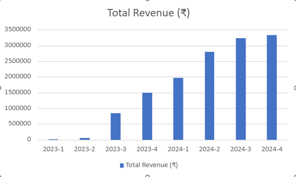
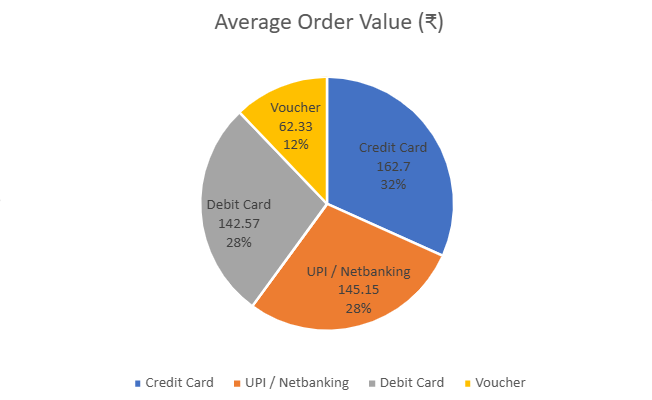
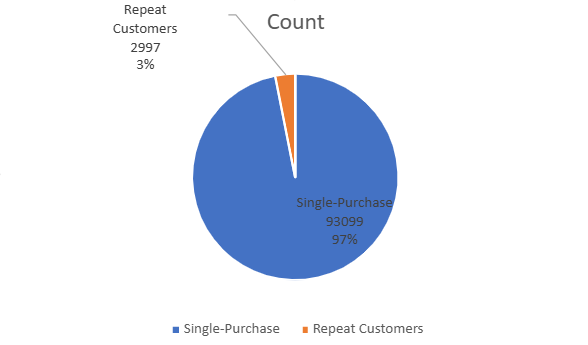
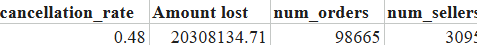
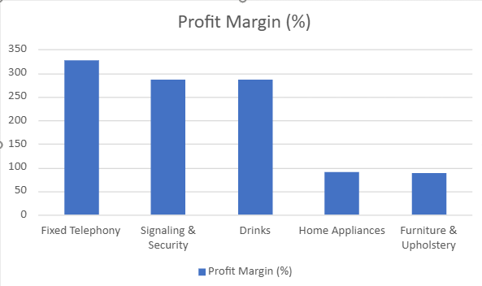

# E-Commerce Business Performance & Sales Funnel Analysis

## Overview
This project analyzes a comprehensive dataset from a rapidly growing Indian e-commerce company. The objective is to explore operations across product listings, sellers, and customer interactions to extract actionable business insights and strategic recommendations for the Indian market.

## Project Goals
* Validate and clean raw e-commerce data to improve analytical accuracy.
* Analyze the data to solve core business problems regarding sales trends, logistics, and customer retention.
* Offer data-driven recommendations to optimize profitability and customer satisfaction across Tier-1 and Tier-2 cities.

## Key Business Insights
* **Revenue & Volume:** The platform generated approximately ₹15.9 million in total revenue across 98,207 total orders.
* **Customer Retention:** The retention rate presents a major bottleneck. Out of 96,096 customers, only 2,997 made repeated purchases, accounting for just 13% of total sales.
* **Payment Preferences:** Credit cards and UPI are the dominant payment methods. Credit cards (used for 76,505 orders) drove the highest Average Order Value (AOV) of ₹162.70, while UPI/Vouchers averaged ₹62.33.
* **Top Products:** "Bed, Bath & Table" is the most popular product category by volume, while "Computer Accessories" are the top-selling items overall.
* **Seller Dynamics:** The platform hosts 4,312 active sellers. Sellers maintaining 4 and 5-star review scores drive the highest total revenue and order volumes.

---

## ANSWERS TO THE BUSINESS QUESTIONS

### 1 & 2) Revenue and Order Volume Trends
The platform processed a total of **98,207 orders**, generating approximately **₹15.9 million** in total revenue. 
* **Peak Season:** January 2024 saw the highest volume with ~7,423 orders.
* **Lowest Period:** Q1 2023 generated the lowest revenue at ~₹3.3 million.

### 3 & 10) Top Product Categories by Volume
"Bed, Bath & Table" drives the highest order volume, but "Computer Accessories" generates the highest total revenue due to its higher price point.

| Rank | Top Categories by Volume | Top Categories by Revenue |
| :--- | :--- | :--- |
| 1 | Bed, Bath & Table | Computer Accessories |
| 2 | Health & Beauty | Health & Beauty |
| 3 | Sports & Leisure | Watches & Gifts |
| 4 | Furniture & Decor | Bed, Bath & Table |
| 5 | Computer Accessories | Sports & Leisure |

### 4 & 11) Payment Methods and Average Order Value (AOV)
Credit Cards dominate the platform's transactions, driving both the highest volume and the highest Average Order Value. 

| Payment Method | Total Orders | Average Order Value (AOV) |
| :--- | :--- | :--- |
| Credit Card | 76,505 | ₹162.70 |
| UPI / Netbanking | 19,784 | ₹145.15 |
| Voucher / Promo | 3,866 | ₹62.33 |
| Debit Card | 1,528 | ₹142.57 |

### 5 & 6) Seller Dynamics & Ratings Impact
The platform grew to **4,312 active sellers** by 2024. There is a strong positive correlation (0.74 coefficient) between high review scores and total revenue generated.

| Review Score | Order Volume Impact | Revenue Correlation |
| :--- | :--- | :--- |
| 5 Stars (Excellent) | Highest Volume | Strong Positive |
| 4 Stars (Very Good) | High Volume | Positive |
| 3 Stars (Good) | Medium Volume | Neutral |
| 1-2 Stars (Poor) | Low Volume (High Churn) | Negative |

### 7) Customer Retention Rate
Retention is a critical bottleneck for the platform, with the vast majority of users churning after a single purchase.

| Customer Type | Total Count | % of Total Sales Generated |
| :--- | :--- | :--- |
| Single-Purchase Customers | 93,099 | 87% |
| Repeat Customers | 2,997 | 13% |

### 9) Order Cancellation Rate
The platform maintains a highly efficient **cancellation rate of just 0.48%**, indicating strong logistics fulfillment and high customer purchase intent once checkout is completed.

### 13 & 14) Profitability & Regional Density
* **Highest Margins:** "Fixed Telephony" (327% margin) and "Signaling & Security" (287% margin).
* **Top Regions:** Maharashtra, Delhi, and Karnataka represent the highest density of customer orders, aligning with Tier-1 city e-commerce trends.

---

## STRATEGIC RECOMMENDATIONS
1. **Implement Targeted Loyalty Programs:** To address the critically low retention rate, introduce loyalty programs with exclusive discounts to reward repeat purchasers and incentivize single-purchase users to return.
2. **Personalize the Customer Experience:** Utilize customer segmentation and data to tailor product recommendations and offers, increasing platform engagement.
3. **Enhance Quality Control & Communication:** Proactively address negative reviews and resolve recurring quality issues for low-rated products to rebuild customer trust and properly manage product expectations.

---
**Data Analysis by:** SAKSHI RAI
**Date:** MARCH 2026
**GitHub:** [https://github.com/Sakshi-Rai164](https://github.com/Sakshi-Rai164)
